# Перезапуск скрипта Планировщиком задач в случае ошибки

Данный проект создан в качестве примера настройки перезапуска Планировщиком задач Python-скрипта в случае ошибки

## Настройка

Для того, чтобы перезапуск скрипта по предлагаемой методике работал, необходимо чтобы в планировщике задач был включен журнал всех заданий

<p align="center">
    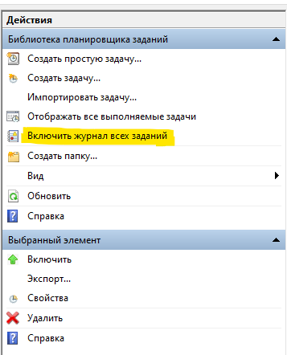
</p>

Если журнал всех заданий включен, то на вкладке `Журнал` отработавших задач должен быть отображен список событий, аналогичный приведенному на иллюстрации

<p align="center">
    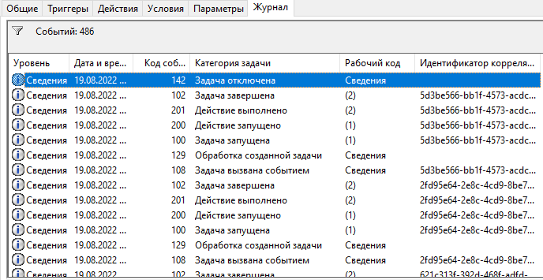
</p>

Создаем в Планировщике задач папку `TestFolder`<br>

<p align="center">
    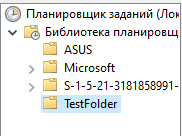
</p>

Создаем новую задачу с именем `ScriptRestart`.

<p align="center">
    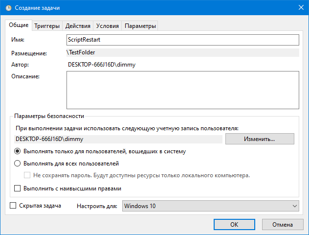
</p>

Добавляем триггеры запуска задачи:

1. Первый триггер устанавливаем на срабатывание по требуемому расписанию

    <p align="center">
        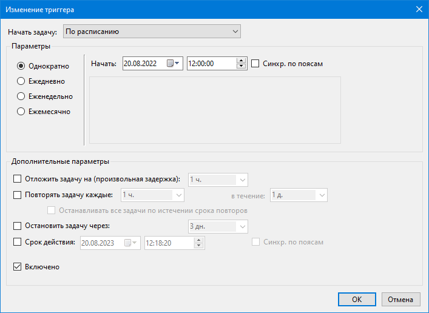
    </p>

1. Второй триггер устанавливаем на срабатывание при событии. Настраиваем отложенный запуск на 30 секунд или больше (чтобы процессы необходимые для успешной работы запускаемого скрипта успели завершиться)

    <p align="center">
        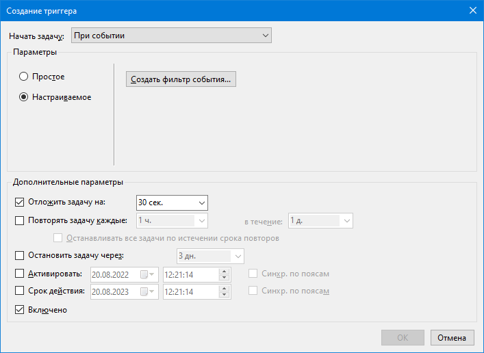
    </p>

    Создаем фильтр события. Переключаемся на вкладку `XML` и ставим галочку `изменить запрос вручную`. В поле ввода текста вставляем указанное XML-выражение

    ```xml
    <QueryList>
      <Query Id="0" Path="Microsoft-Windows-TaskScheduler/Operational">
        <Select Path="Microsoft-Windows-TaskScheduler/Operational">
          *[System[EventID=201]] and
          *[EventData[Data[@Name='TaskName']='\TestFolder\ScriptRestart']] and
          *[EventData[Data[@Name='ResultCode']!='0']]
        </Select>
      </Query>
    </QueryList>
    ```

    <p align="center">
        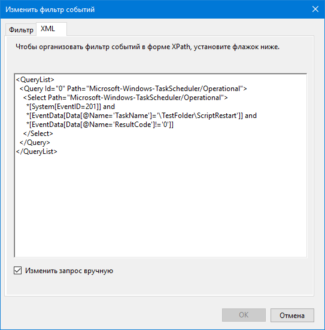
    </p>

    Сохраняем триггер

На вкладке `Действия` добавляем новое действие для задачи. В поле `Программа или сценарий` указываем путь к файлу интерпретатора Python `python.exe`, в поле ввода рабочей папки указываем абсолютный путь к папке с запускаемым скриптом, а в качестве аргумента передаем название файла скрипта.

<p align="center">
    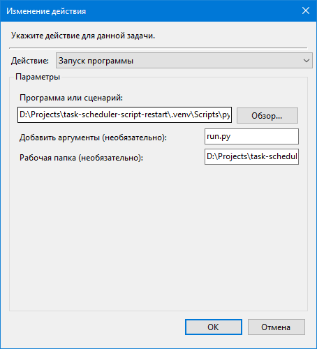
</p>

Готово. Сохраняем задачу.

### Дополнительно

Если нам не нужно, чтобы задача находилась в отдельной папке (напр. `TestFolder`), то мы можем создать задачу в корневой папке Планировщика задач. В таком случае в XML-выражении вместо аргумента `*[EventData[Data[@Name='TaskName']='\TestFolder\ScriptRestart']]` должен стоять аргумент `*[EventData[Data[@Name='TaskName']='\ScriptRestart']]`

---

## Работа скрипта

Созданная и настроенная нами задача запустится по расписанию и выведет окно с сообщением.

Если появится сообщение `Success`, значит скрипт отработал успешно.

<p align="center">
    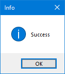
</p>

<div class="page"/>

Если появится сообщение `Fail`, значит скрипт завершился с ошибкой. В таком случае наш скрипт будет перезапускаться с заданной задержкой до тех пор, пока не появится сообщение `Success`

<p align="center">
    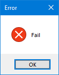
</p>

## Заключение

После завершения работы задачи, на вкладке `Журнал` можно увидеть событие с кодом 201, которое для успешного выполнения задачи будет выглядеть так:

<p align="center">
    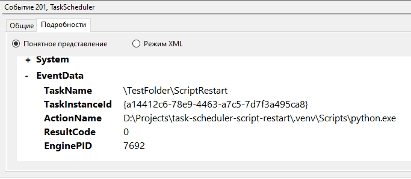
</p>

В случае ошибки описание события будет следующим:

<p align="center">
    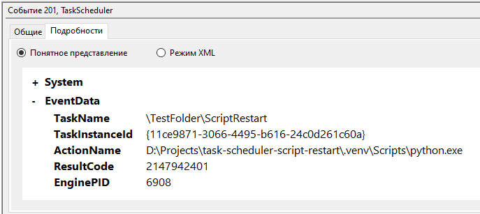
</p>

Таким образом, мы настроили перезапуск нашего скрипта в случае, если в журнале планировщика задач появляется запись о событии с кодом 201 (успешное завершение задачи) с кодом результата (ResultCode) отличным от 0 (Обычно программа возвращает код 0 в случае завершения без ошибок). Необходимо отметить, что в случае, когда скрипт не может завершиться успешно в силу объективных причин (напр. отключение интернета), по настроенной нами логике он будет перезапускаться бесконечно.